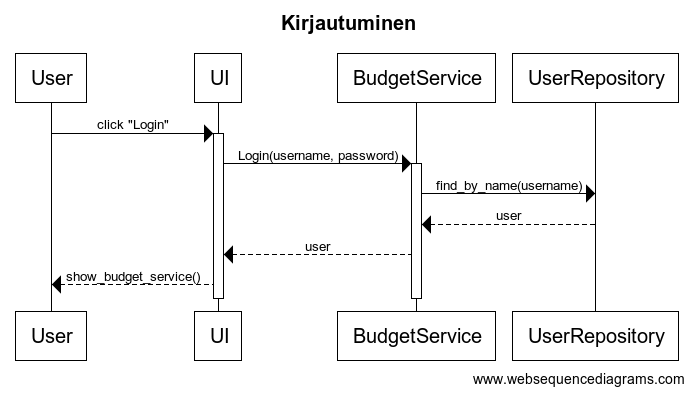
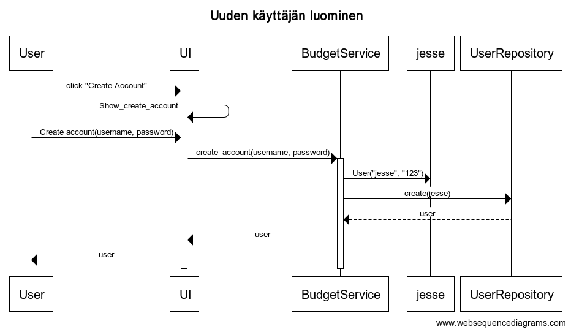

# Arkkitehtuuri

## Käyttöliittymä
Sisältää kolme näkymää
- Kirjautumisnäkymä
- Uuden käyttäjän luomisnäkymä
- Budgetview, joka näyttää itse sovelluksen.

## Tietojen tallennus
Ohjelmiston tiedot tallennetaan luokkien user_repository ja expense_repository kautta. Molemmat tallentavat tiedot SQLite-tietokantaa. Repository-suunnittelumallia on noudatettu luokkia tehtäessä.

## Päätoiminnallisuudet
Seuraavat sekvenssikaaviot kuvastavat muutamia päätoiminnallisuuksia.

### Kirjautuminen
Kirjautuessa etenee sovelluksen logiikka seuraavalla tavalla.

### Käyttäjän luominen

