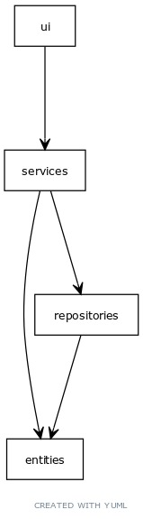

# Arkkitehtuuri

## Rakenne

## Käyttöliittymä
Sisältää kolme näkymää
- Kirjautumisnäkymä
- Uuden käyttäjän luomisnäkymä
- Budgetview, joka näyttää itse sovelluksen.

## Sovelluslogiikka 
Loogista tietomalia toteuttavat Expense ja User luokat, ne kuvaavat käyttäjiä ja budjetteja. 

Ohjelmiston toiminnallisuuksista vastaa budget_service luokka. Se hoitaa kirjautumiset kuin lisäykset. 
## Tietojen tallennus
Ohjelmiston tiedot tallennetaan luokkien user_repository ja expense_repository kautta. Molemmat tallentavat tiedot SQLite-tietokantaa. Repository-suunnittelumallia on noudatettu luokkia tehtäessä.

Taulukot alustetaan initialize_database.py tiedostossa

## Päätoiminnallisuudet
Seuraavat sekvenssikaaviot kuvastavat muutamia päätoiminnallisuuksia.

### Kirjautuminen
Kirjautuessa etenee sovelluksen logiikka seuraavalla tavalla.

Painamalla painiketta login ohjaa UI, sovelluslogiikalle käyttäjän antamat tiedot, sovelluslogiika tarkistaa että antama käyttäjä löytyy tai heittää errorin jos kyseistä käyttäjää ei löydy.
### Käyttäjän luominen
Siirryttäessä käyttäjä luomiseen toimii sovelluslogiikka kyseisellä tavalla.

Tiedot siirtyvät sovelluslogiikalle, jossa ne tarkistetaan että kyseistä käyttäjätunnusta ei ole olemassa, jos on heittää logiikka virhe-ilmoituksen ruudulla, ja jos ei ole niin käyttäjä luodaan.
### Tulo/menon luominen
 

Luodessa tulo/menoa sovelluslogiikka ottaa kirjautuneen käyttäjän nimen budget_servicestä ja tulo/menon määrän minkä käyttäjä on antanut ja lisää sen tietokantaan.

### Ohjelman rahkenteelliset heikkoudet
- Tulo/menon lisääminen olisi voitu eriyttää enemmän vielä servicen puolelle, sekä budget_view luokka on hieman sekava.
