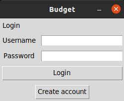

# Käyttöohje

Aloita lataamalla projektin viimeisimmän [releasen](https://github.com/Ahannila/ot-harjoitustyo/releases) lähdekoodi valitsemalla _Assets_-osion alta _Source code_.


### Ohjelman suorittaminen
```bash
poetry run invoke build
```

```bash
poetry run invoke start
```


## Kirjautuminen


Ruudulle ilmestyy kirjautumisruutu. Jos olet jo tehnyt käyttäjän syötä ruutuihin käyttäjänimesi ja salasanasi ja paina login. Jos sinulla ei ole käyttäjää paina Create account.

## Uuden käyttäjän luominen


Uusi käyttäjä luodaan siirtymällä kirjautumisruudulta käyttäjänluomisruutuun painamalla create user-painiketta. Kirjoita ruutuihin haluamasi käyttäjätunnus ja salasana. Ruutuun ilmoitetaan että käyttäjä on luotu ja voit palata edelliseen näkymään painamalla Back to login.

## Uuden kulun/menon lisäys


Tässä näkymässä voit lisätä uusia Menon/kulun. Meno lisätään Add income painikkeesta ensin syöttämällä kenttään menon määrän numeroina ja sitten painamalla Add expense painiketta. Sama käytäntö on Add expense kohdassa. Tulo/menolle voi lisätä myös nimen syöttämällä se ylläolevaan ruutuun samaan aikaan kun olet lisäämässä budjettia. Sovelluksesta lähdetään painamalla yläoikeaa X nappia.