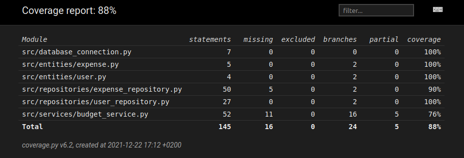

# Testausdokumentti

Ohjelmaa on testattu unittestilla automaattisesti sekä manuaalisesti.

## Sovelluslogiikka
Budget_service-luokkaa testataan test_budget_service-luokalla, oliot alustetaan testien alussa ja tallennetaan muistiin, poistaen muun tiedon sieltä.

## Repositoriot
Repositorio-luokat expense_repository ja user_repository on testattu alustamalla tietokannat ja lisäämällä niihin tietoja ja vertailtu tuloksia.
## Testauskattavuus

